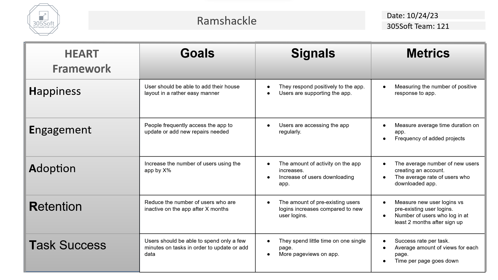

# Metrics for Ramshackle

* metric 1 - Once metric we observe is how many people are using the applications by using Google Analytics within Google Firebase. By using this we can see how many users use site, how long they are on it for, and other information such as where in the world they were using it from. With information such as this we can design and update our app so that it can be used by a
  broad spectrum of people not just friends and family.  
  
* Metric 2 - One metric we can observe is the notification effectiveness by using google analytics within google firebase. We can utilize Firebase Cloud Messaging to send notifications to users; providing the user with relevant information to them. From there we can measure the effectiveness of those messages depending upon their initial intent. For example; if we wanted to send a notification to users to remind them they should log on and schedule a maintenance for a room that our systems detect should need an update. We can then track whether or not hte user logged on within a given timeframe of recieving the notification. AS well as how long they used the app after having logged in. We could further this analaysis by conducting A/B testing with different versions of notifications, to try and discover if the form of notification recieved increases the responsiveness of the users.  
  
* Metric 3 - One metric we can observe is retention. By monitoring on an annual basis, the reoccurrence of our users logging into our application, we can see how many of our users continue to use our application after the initial download. This is especially important for an application that will not be used on a daily basis. 
   
* Metric 4 -  
  
* Metric 5 - Probably the most important metric for the second A/B Test is the number of users who exit the app entirely when an interstitial ad pops up. This number will allow us to see if those who receive interstitial ads between pages instead of banner ads at the bottom decide that it's simply too much of a hassle to deal with.
